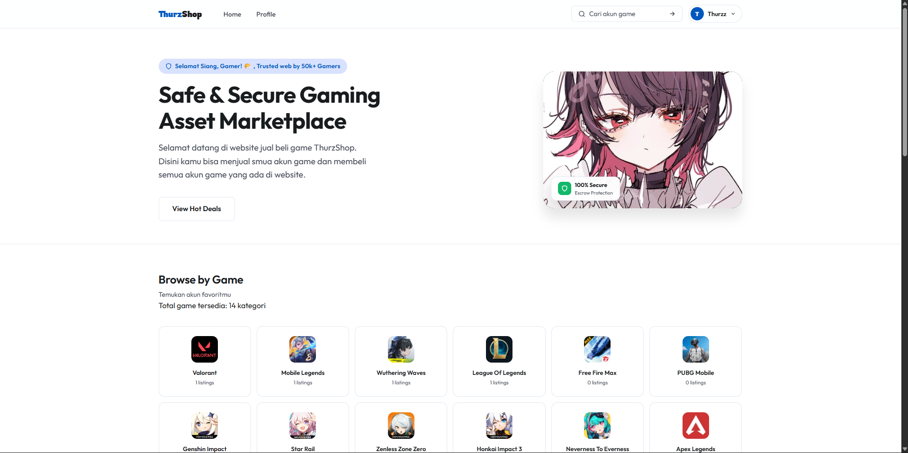
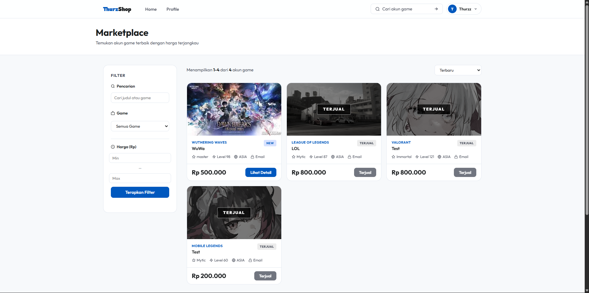
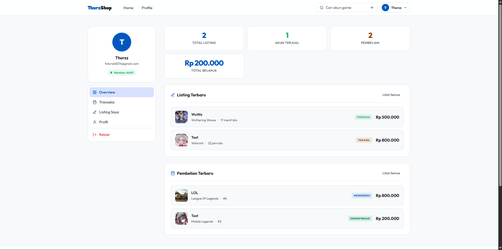
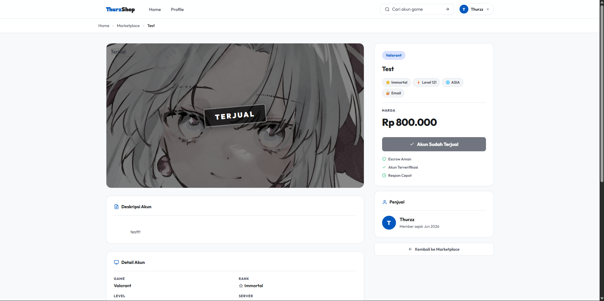
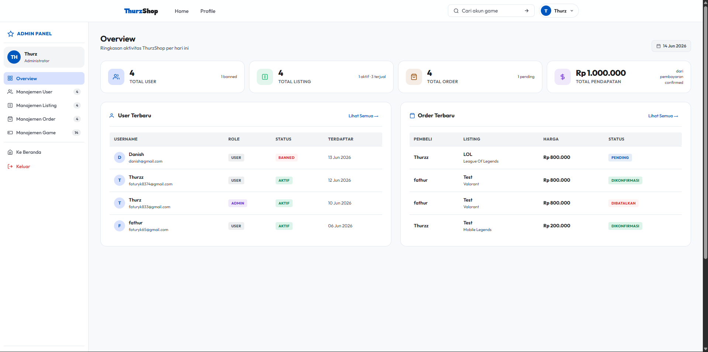
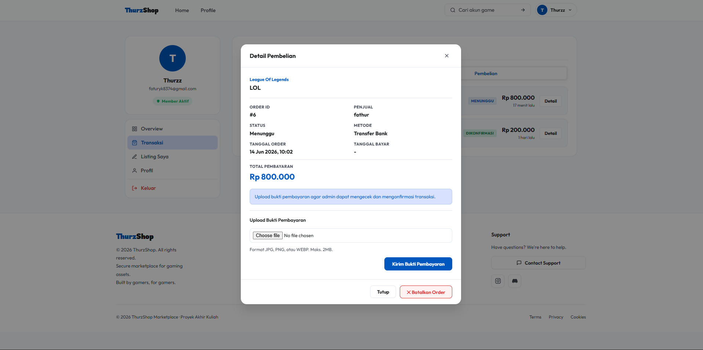

<div align="center">
<br/>

[](https://php.net)
[](https://mysql.com)
[](https://developer.mozilla.org/en-US/docs/Web/CSS)
[](https://developer.mozilla.org/en-US/docs/Web/JavaScript)

<br/>

> **ThurzShop** adalah marketplace berbasis web untuk jual beli akun game secara **aman**, **cepat**, dan **terpercaya**.  
> Dibangun dengan PHP native, MySQL, Java Script, dan CSS.

<br/>

[](https://fathurz-shop.trpl25.com)
[](https://youtube.com)

</div>

---

## 📸 Screenshot

<div align="center">

| Homepage | Marketplace | Dashboard User |
|:---:|:---:|:---:|
|  |  |  |

| Detail Listing | Admin Panel | Order & Payment |
|:---:|:---:|:---:|
|  |  |  |

</div>

---

## ✨ Fitur Utama

<table>
<tr>
<td width="50%">

### 👤 Fitur User
- 🔐 Register & Login dengan session
- 🛒 Jual beli akun game
- 📋 Dashboard kelola listing sendiri
- 💳 Upload bukti pembayaran QRIS
- 📦 Riwayat order & tracking status
- 🔑 Akses credential akun setelah konfirmasi

</td>
<td width="50%">

### 🛡️ Fitur Admin
- 👥 Manajemen user (ban/unban)
- 🎮 CRUD data game
- ✅ Verifikasi & kelola listing
- 📑 Konfirmasi pembayaran & order
- 📊 Dashboard statistik
- 🔏 Sistem escrow (credential terlindungi)

</td>
</tr>
</table>

---

## 🎮 Game yang Didukung

<div align="center">

| Game | Genre | Platform | Listing |
|:---:|:---:|:---:|:---:|
| 🎯 Valorant | Tactical Shooter | PC | 1.200+ |
| ⚔️ Mobile Legends | MOBA | Mobile | 3.400+ |
| 🔥 Free Fire Max | Battle Royale | Mobile | 2.100+ |
| 🎮 PUBG Mobile | Battle Royale | Mobile | 1.800+ |
| ✨ Genshin Impact | RPG | PC/Mobile | 980+ |
| 🚄 Honkai: Star Rail | Turn-based RPG | PC/Mobile | 760+ |
| 🌊 Wuthering Waves | RPG | PC/Mobile | 800+ |

</div>

---

## 🗂️ Struktur Proyek

```
📦 public_html/
├── 📄 index.php                  # Halaman utama & hot deals
├── 📁 pages/
│   ├── 📄 marketplace.php        # Listing semua akun game
│   ├── 📄 listing-detail.php     # Detail listing + tombol beli
│   ├── 📄 create_order.php       # Proses pembelian
│   ├── 📄 login.php              # Halaman login
│   ├── 📄 register.php           # Halaman registrasi
│   ├── 📁 users/
│   │   ├── 📄 dashboard.php      # Dashboard penjual/pembeli
│   │   ├── 📄 add_listing.php    # Upload akun game baru
│   │   ├── 📄 update_listing.php # Edit listing
│   │   └── 📄 upload_proof.php   # Upload bukti bayar
│   └── 📁 admin/
│       ├── 📄 dashboard.php      # Panel admin
│       ├── 📄 action_user.php    # Kelola user
│       ├── 📄 action_listing.php # Kelola listing
│       ├── 📄 action_order.php   # Konfirmasi order
│       └── 📄 add_game.php       # Tambah game baru
├── 📁 includes/
│   ├── 📄 db.php                 # Koneksi database
│   └── 📄 header.php             # Navigasi global
├── 📁 assets/
│   ├── 🎨 style.css              # Stylesheet utama
│   └── ⚡ main.js               # Script interaktif
└── 📁 db/
    └── 🗄️ projectakhir.sql       # Schema & data database
```

---

## 🗄️ Skema Database

```sql
📊 Tabel Utama:
┌─────────────────────┬──────────────────────────────────────────────┐
│ Tabel               │ Keterangan                                   │
├─────────────────────┼──────────────────────────────────────────────┤
│ users               │ Data akun pengguna (user & admin)            │
│ games               │ Daftar game yang tersedia                    │
│ account_listing     │ Listing akun game yang dijual                │
│ account_credentials │ Kredensial akun (terkunci hingga terkonfirmasi) │
│ orders              │ Data transaksi & pesanan                     │
│ payment             │ Bukti pembayaran QRIS                        │
├─────────────────────┼──────────────────────────────────────────────┤
│ v_listing_marketplace│ View: marketplace dengan info lengkap       │
│ v_order_detail      │ View: detail order dengan join tabel         │
└─────────────────────┴──────────────────────────────────────────────┘

🔧 Fungsi Kustom:
  • fn_format_rupiah()      → Format angka ke mata uang Rupiah
  • fn_user_total_belanja() → Hitung total transaksi per user
```

---

## ⚙️ Cara Instalasi

### Prasyarat
- ✅ PHP 8.x
- ✅ MySQL 8.0
- ✅ Apache / XAMPP / Laragon

### Langkah Instalasi

**1. Clone repository ini**
```bash
git clone https://github.com/[USERNAME]/thurzshop.git
cd thurzshop
```

**2. Import database**
```bash
# Buka phpMyAdmin atau gunakan MySQL CLI:
mysql -u root -p

# Buat database baru:
CREATE DATABASE db_thurzshop;
USE db_thurzshop;

# Import file SQL:
source db/projectakhir.sql;
```

**3. Konfigurasi koneksi database**

Edit file `includes/db.php`:
```php
$host     = "localhost";
$user     = "root";
$password = "";           // Sesuaikan dengan password MySQL kamu
$database = "db_thurzshop";
```

**4. Jalankan project**
```
Letakkan folder di: C:/xampp/htdocs/thurzshop
Akses di browser  : http://localhost/thurzshop
```

---

## 🔑 Akun Demo

| Role | Username | Password |
|:---:|:---:|:---:|
| 👑 Admin | `Thurz` | `[password admin]` |
| 👤 User | `fathur` | `[password user]` |

> ⚠️ *Ganti password default sebelum deploy ke production!*

---

## 🔄 Alur Transaksi

```
Penjual                    Sistem                    Pembeli
   │                          │                          │
   ├── Upload listing ────────►│                          │
   │                          │◄─── Browse marketplace ──┤
   │                          │◄─── Klik "Beli Sekarang"─┤
   │                          ├── Buat order ─────────── ►│
   │                          │◄─── Upload bukti bayar ───┤
   │                    [Admin konfirmasi]                 │
   │                          ├── Buka credential ──────► │
   │                          │                    Dapat akun ✅
```

---

## 🛠️ Tech Stack

<div align="center">

| Layer | Teknologi |
|:---:|:---:|
| **Backend** | PHP 8 Native (tanpa framework) |
| **Database** | MySQL 8 (dengan View & Stored Function) |
| **Frontend** | HTML5, CSS3 Custom Variables, Vanilla JS |
| **Font** | Google Fonts — Outfit & Rowdies |
| **Auth** | PHP Session |
| **Payment** | QRIS (manual upload bukti) |

</div>

---

## 📁 File Pengumpulan UAS

```
📦 Pengumpulan/
├── 📁 public_html.zip        ✅ Source code lengkap
├── 🗄️ projectakhir.sql       ✅ File database
└── 📄 link_youtube.txt       ✅ Link video demo YouTube
```

---

## 👨‍💻 Developer

<div align="center">

| | |
|:---:|:---|
| **Nama** | Faturrohim Agni Darma |
| **NIM** | 25/556330/SV/25913 |
| **Prodi** | [Teknologi Rekayasa Perangkat Lunak] |
| **Mata Kuliah** | Praktikum Pemrograman Web 1 |
| **Institusi** | Universitas Gadjah Mada |

<br/>

[](mailto:faturyk65@gmail.com)

</div>

---

## 📄 Lisensi

Project ini dibuat untuk keperluan **Ujian Akhir Semester (UAS)** mata kuliah Pemrograman Web.  
Bebas digunakan sebagai referensi pembelajaran. ✌️

---

<div align="center">

**⭐ Kalau project ini membantu, jangan lupa kasih bintang ya! ⭐**

<br/>

*Made with ❤️ and ☕ by Thurz*

</div>
